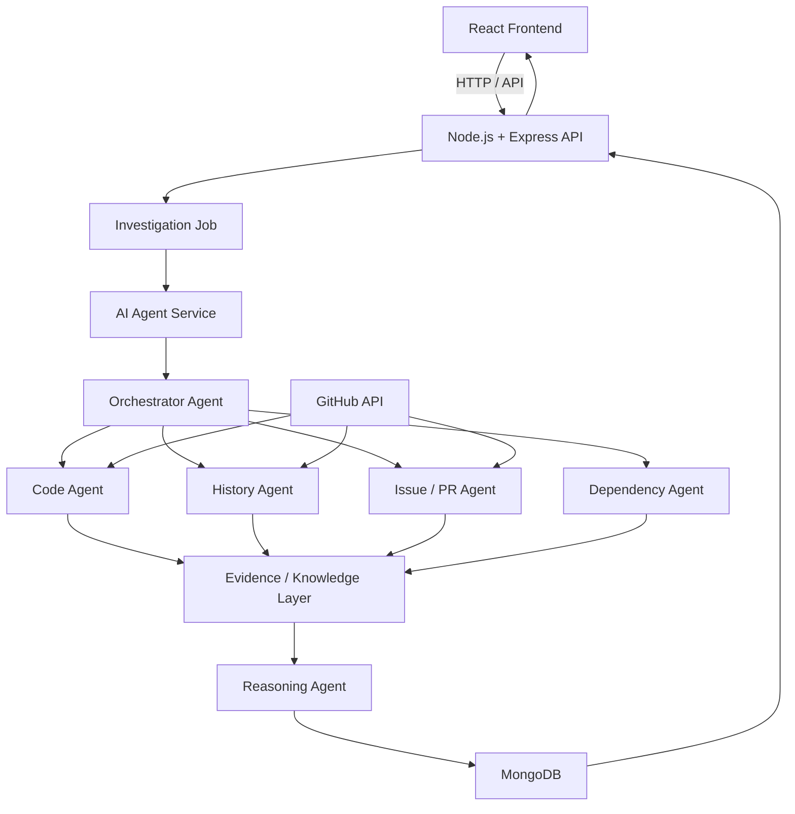

# CodeArchaeologist — AI-Powered Software Archaeology

<p align="center">
  <em>
    A full-stack multi-agent platform that investigates GitHub repositories,
    reconstructs the history behind engineering decisions, maps dependencies
    and risks, and turns forgotten software knowledge into actionable intelligence.
  </em>
</p>

<p align="center">
  
  
  
  
  
  
  
  
  
</p>

<p align="center">
  <strong>Don't just understand the code. Discover why it survived.</strong>
</p>

---

#  About

**CodeArchaeologist** is a full-stack, multi-agent AI platform designed to uncover the hidden history of software repositories.

Modern codebases contain years of engineering decisions, migrations, emergency fixes, workarounds, dependencies, issues, pull requests, and undocumented business rules.

The current code tells engineers **what the system does**.

But when developers inherit an unfamiliar codebase, the more important question is often:

> **Why was it built this way?**

CodeArchaeologist investigates both the **present state and historical evolution** of a repository to reconstruct the reasoning behind important engineering decisions.

Instead of treating a GitHub repository as a collection of files, CodeArchaeologist treats it as an evolving body of **software memory**.

---

#  The Problem

When engineers inherit a mature codebase, critical context is often scattered across:

- Source code
- Git commits
- Git blame
- Pull requests
- GitHub issues
- Dependencies
- Documentation
- Historical workarounds

This creates several problems:

- Slow developer onboarding
- Risky refactoring
- Repeated investigation of old decisions
- Undocumented business logic
- Forgotten workarounds
- Difficulty understanding legacy components
- Loss of institutional knowledge when developers leave

For example:

```text
if (account.type == X) {
    useLegacyPayment();
}
```

The code tells us:

> WHAT happens.

But an engineer needs to know:

> WHY does `account.type == X` require this legacy path?

CodeArchaeologist investigates the repository to reconstruct that missing context.

---

#  Core Features
 
-  GitHub Repository Ingestion
-  Repository Structure Analysis
-  Code Intelligence
-  Git History Analysis
-  Commit & Diff Analysis
-  Issue / Pull Request Analysis
-  Multi-Agent Investigation
-  Historical Decision Reconstruction
-  Evidence-Backed Answers
-  Repository Evolution Timeline
-  Dependency Analysis
-  Risk Detection
-  Decision Forensics
-  AI Investigation Chat
-  Interactive Repository Dashboard
-  Cloud Deployment
-  Asynchronous Investigation Workflow
-  Advanced Knowledge Graph
---

#  What Makes CodeArchaeologist Different?

Traditional repository tools generally answer:

> **"What is this code?"**

CodeArchaeologist focuses on:

> **"Why does this code exist?"**

It combines multiple sources of repository evidence instead of relying on an LLM's general knowledge.

```text
Current Code
     +
Git History
     +
Issues
     +
Pull Requests
     +
Dependencies
     +
Documentation
     ↓
Multi-Agent Investigation
     ↓
Evidence
     ↓
Reasoning
     ↓
Historical Intent
     ↓
Actionable Insight
```

The system is designed so that important conclusions can be connected back to repository evidence rather than being presented as unsupported AI guesses.

---

#  Multi-Agent Architecture

CodeArchaeologist uses specialized agents instead of relying on a single general-purpose AI prompt.

```text
                         USER
                           │
                           ▼
                  ┌─────────────────┐
                  │   React Client  │
                  └────────┬────────┘
                           │
                           ▼
                  ┌─────────────────┐
                  │ Node + Express  │
                  │    API Layer    │
                  └────────┬────────┘
                           │
                           ▼
                  ┌─────────────────┐
                  │   Orchestrator  │
                  │      Agent      │
                  └────────┬────────┘
                           │
          ┌────────────────┼────────────────┐
          │                │                │
          ▼                ▼                ▼
   ┌────────────┐   ┌────────────┐   ┌────────────┐
   │ Code Agent │   │   History  │   │ Issue / PR │
   │            │   │   Agent    │   │   Agent    │
   └─────┬──────┘   └─────┬──────┘   └─────┬──────┘
         │                │                │
         └────────────────┼────────────────┘
                          ▼
                  ┌─────────────────┐
                  │ Dependency Agent│
                  └────────┬────────┘
                           │
                           ▼
                  ┌─────────────────┐
                  │ Evidence Layer │
                  └────────┬────────┘
                           │
                           ▼
                  ┌─────────────────┐
                  │ Reasoning Agent │
                  └────────┬────────┘
                           │
                           ▼
                  ┌─────────────────┐
                  │ Structured      │
                  │ Investigation   │
                  │ Results         │
                  └────────┬────────┘
                           │
                           ▼
                    React Dashboard
```

---

#  Agent Responsibilities

## Code Agent

Understands the current repository structure.

Analyzes:

* Files
* Functions
* Classes
* Imports
* Modules
* Entry points
* Architecture
* Code relationships

Example question:

> "Where is authentication implemented?"

---

## History Agent

Investigates how the repository evolved.

Analyzes:

* Commits
* Commit messages
* Diffs
* Git blame
* File history
* Major architectural changes

Example question:

> "When was this fallback introduced?"

---

## Issue / PR Agent

Connects implementation changes to developer discussions.

Analyzes:

* GitHub Issues
* Pull Requests
* Discussions
* Bug reports
* Requirements
* Migration decisions

Example question:

> "Why was this implementation changed?"

---

## Dependency Agent

Analyzes relationships between components.

Example:

```text
CheckoutService
       ↓
PaymentService
       ↓
LegacyPaymentFallback
       ↓
PaymentProvider
```

This allows CodeArchaeologist to reason about questions such as:

> "What could break if this component is removed?"

---

## Reasoning Agent

Combines evidence from all specialized agents.

It reconstructs:

* Historical intent
* Engineering decisions
* Current impact
* Risk
* Dependencies
* Confidence
* Recommendations

The goal is not simply to generate an answer.

The goal is to generate an **evidence-backed explanation**.

---

# 🔎 Decision Forensics

Decision Forensics is one of the core experiences of CodeArchaeologist.

A developer can ask:

> **Why does `PaymentService` still use the legacy fallback?**

The system investigates:

```text
PaymentService
      ↓
Git blame
      ↓
Original commit
      ↓
Related commits
      ↓
Pull Request
      ↓
GitHub Issue
      ↓
Dependent modules
      ↓
Reasoning Agent
```

The final result can contain:

```text
Historical Intent
────────────────────────────────

Introduced during a payment-provider
migration to handle timeout failures.


Evidence
────────────────────────────────

Commit: a81f2
PR: #142
Issue: #89
File: PaymentService.ts


Current Impact
────────────────────────────────

11 modules depend on this behaviour.


Risk
────────────────────────────────

HIGH


Recommendation
────────────────────────────────

Preserve the fallback until equivalent
behaviour is tested and downstream
dependencies are migrated.
```

---

#  Repository Evolution Timeline

CodeArchaeologist reconstructs important events in the evolution of a repository.

Example:

```text
2019
│
├── System created
│
2020
│
├── Payment provider migration
│
2021
│
├── Emergency fallback introduced
│
2023
│
├── Dependency architecture changed
│
2025
│
└── Documentation gap detected
```

This allows developers to understand **how the current architecture came to exist**.

---

#  Risk & Impact Analysis

CodeArchaeologist can identify areas that deserve engineering attention.

Potential signals include:

* Highly connected components
* Deprecated dependencies
* Legacy implementations
* Undocumented workarounds
* Components with many dependents
* Historical emergency fixes
* Architecture hotspots

Example:

```text
┌─────────────────────────────────┐
│ PaymentService                  │
│                                 │
│ Risk: 🔴 HIGH                   │
│                                 │
│ Dependents: 11                  │
│ Historical fixes: 4             │
│ Legacy dependency: 1            │
│ Documentation: Missing          │
└─────────────────────────────────┘
```

---

#  AI Investigation

Users can ask natural-language questions about the repository.

Examples:

```text
Why does this function exist?

When was this component introduced?

What changed after this commit?

Which modules depend on this service?

What could break if I remove this?

Why is this dependency still being used?

Which parts of the codebase are risky?

What was the original reason for this workaround?
```

The AI uses repository-specific context rather than relying only on general model knowledge.

---

#  Tech Stack

| Layer                   | Technology                        |
| ------------------------ | ---------------------------------- |
| Frontend                | React + Vite                       |
| Styling                 | Tailwind CSS                       |
| Routing                 | React Router                       |
| Backend                 | Node.js + Express                  |
| Database                | MongoDB + Mongoose                 |
| AI Service              | Python + FastAPI                   |
| Agent Framework         | LangGraph                          |
| LLM                     | Gemini / OpenAI / Compatible LLM   |
| Repository Integration  | GitHub API                         |
| Code Analysis           | Git / Repository Parsers           |
| Retrieval               | RAG + Embeddings                   |
| Knowledge Layer         | Graph / Vector Storage             |
| Containerization        | Docker                             |
| Cloud                   | Cloud-hosted deployment            |
| Version Control         | Git + GitHub                       |

> The exact AI model, vector database and cloud provider can be configured through environment variables.

---

#  System Architecture



---

#  Technical Workflow

## 1. Repository Submission

```text
User enters GitHub URL
        ↓
Frontend sends repository URL
        ↓
Express validates request
        ↓
Investigation created
```

---

## 2. Repository Ingestion

```text
GitHub Repository
        ↓
Files
Commits
Issues
Pull Requests
Dependencies
Documentation
        ↓
Structured Repository Data
```

---

## 3. Agent Investigation

```text
Repository Data
        ↓
Orchestrator
        ↓
Specialized Agents
        ↓
Evidence Collection
```

Each agent focuses on a different aspect of the repository.

---

## 4. Evidence Correlation

```text
Code
 ↓
Commit
 ↓
Diff
 ↓
Pull Request
 ↓
Issue
 ↓
Dependency
```

These relationships allow the system to reconstruct the context surrounding engineering decisions.

---

## 5. Reasoning

The Reasoning Agent receives the collected evidence and produces structured insights:

```text
Historical Intent
        +
Current Context
        +
Dependencies
        +
Risk
        +
Evidence
        ↓
Final Investigation
```

---

## 6. Results

The frontend presents:

```text
Repository Overview
        ↓
Architecture
        ↓
Evolution Timeline
        ↓
Decision Forensics
        ↓
Risk Analysis
        ↓
AI Investigation
```

---

#  API Workflow

## Start Investigation

```http
POST /api/investigations
```

### Request

```json
{
  "repoUrl": "https://github.com/example/repository"
}
```

### Response

```json
{
  "investigationId": "abc123",
  "status": "queued"
}
```

---

## Investigation Status

```http
GET /api/investigations/:id/status
```

### Response

```json
{
  "status": "analyzing",
  "progress": 67,
  "currentAgent": "History Agent"
}
```

---

## Repository Overview

```http
GET /api/investigations/:id/overview
```

---

## Timeline

```http
GET /api/investigations/:id/timeline
```

---

## Decision Forensics

```http
GET /api/investigations/:id/decisions
```

---

## Risk Analysis

```http
GET /api/investigations/:id/risks
```

---

## Ask CodeArchaeologist

```http
POST /api/investigations/:id/questions
```

### Request

```json
{
  "question": "Why does PaymentService use the legacy fallback?"
}
```

### Response

```json
{
  "answer": "The fallback was introduced during...",
  "confidence": 0.91,
  "evidence": [
    {
      "type": "commit",
      "id": "a81f2"
    }
  ]
}
```

---

# 🔐 Environment Variables

## Backend

```env
PORT=
MONGODB_URI=
GITHUB_TOKEN=
AI_SERVICE_URL=
CORS_ORIGIN=
JWT_SECRET=
```

## AI Service

```env
LLM_API_KEY=
GITHUB_TOKEN=
VECTOR_DB_URL=
VECTOR_DB_API_KEY=
```

## Frontend

```env
VITE_API_URL=
```

> Never commit API keys, database credentials, GitHub tokens or other secrets to the repository.

---

#  Getting Started

## Prerequisites

Make sure you have:

* Node.js 18+
* npm
* Python 3.10+
* Git
* MongoDB
* GitHub account
* LLM API key

---

## 1. Clone the Repository

```bash
git clone https://github.com/YOUR_USERNAME/CodeArchaeologist.git

cd CodeArchaeologist
```

---

## 2. Install Frontend

```bash
cd frontend
npm install
```

---

## 3. Install Backend

```bash
cd ../backend
npm install
```

---

## 4. Install AI Service

```bash
cd ../ai-service

python -m venv venv

# Windows
venv\Scripts\activate

# macOS / Linux
source venv/bin/activate

pip install -r requirements.txt
```

---

## 5. Configure Environment Variables

Create the required `.env` files:

```text
frontend/.env
backend/.env
ai-service/.env
```

Use the `.env.example` files as references.

---

## 6. Run the Application

### Backend

```bash
cd backend
npm run dev
```

### Frontend

```bash
cd frontend
npm run dev
```

### AI Service

```bash
cd ai-service
uvicorn main:app --reload
```

---

# 🐳 Docker

The project can also be containerized so that the frontend, backend, AI service and supporting infrastructure can be run consistently across development and deployment environments.

```bash
docker compose up --build
```

---

# 🌐 Deployment Architecture

```text
                       INTERNET
                           │
                           ▼
                  ┌─────────────────┐
                  │ React Frontend  │
                  └────────┬────────┘
                           │
                           ▼
                  ┌─────────────────┐
                  │ Express Backend │
                  └────────┬────────┘
                           │
                    Investigation
                           │
                           ▼
                  ┌─────────────────┐
                  │ Agent Workers   │
                  └────────┬────────┘
                           │
                           ▼
                  ┌─────────────────┐
                  │  AI Service     │
                  └────────┬────────┘
                           │
               ┌───────────┼───────────┐
               ▼           ▼           ▼
            GitHub     Knowledge     MongoDB
                         Layer
```

---

# 🧪 Example Investigation

### User

```text
Why does PaymentService still use LegacyPaymentFallback?
```

### CodeArchaeologist

```text
Historical Intent
────────────────────────────────────────

LegacyPaymentFallback was introduced during
a payment-provider migration to handle timeout
failures.


Evidence
────────────────────────────────────────

Commit: a81f2
Pull Request: #142
Issue: #89

Related File:
PaymentService.ts


Dependency Impact
────────────────────────────────────────

11 modules currently depend on this behaviour.


Risk
────────────────────────────────────────

🔴 HIGH


Recommendation
────────────────────────────────────────

Do not remove the fallback immediately.
First isolate the dependency, add behavioural
tests and migrate downstream modules.
```

This transforms repository archaeology from:

```text
"Here's what the code does."
```

into:

```text
"Here's why the code exists,
here's the evidence,
here's what depends on it,
and here's what you should do next."
```

---

# 🔮 Future Roadmap

* [ ] Advanced repository knowledge graph
* [ ] Support for larger repositories
* [ ] More programming languages
* [ ] Semantic code search
* [ ] Automated architectural diagrams
* [ ] Historical decision clustering
* [ ] Automated technical debt detection
* [ ] Advanced change-impact simulation
* [ ] IDE integration
* [ ] GitHub App integration
* [ ] Continuous repository monitoring
* [ ] Automated documentation generation
* [ ] Suggested refactoring plans
* [ ] Pull-request review using repository history

---

#  Why CodeArchaeologist?

### Software Has a Memory.

Every repository contains traces of the decisions that shaped it:

```text
Code
+
Commits
+
Issues
+
Pull Requests
+
Dependencies
+
Human Decisions
```

But that history is rarely available when engineers need it.

CodeArchaeologist brings those fragments together and turns them into **searchable, explainable and actionable software intelligence**.

### Our Core Belief

> **Code can survive its creator. Its context shouldn't have to die with them.**

---

#  Team
 
| Role                             | Name            | Responsibility                                                                                |
| --------------------------------- | --------------- | ----------------------------------------------------------------------------------------------- |
| Full-Stack Developer             | Radhika Gupta   | Architected and shipped the entire React + Node.js + Express + MongoDB stack end-to-end — wiring real-time investigation pipelines, API integration, and a production-grade dashboard from the ground up |
| AI Developer                     | Anshika Vats    | Multi-agent architecture, LLM integration, repository reasoning, RAG and evidence generation   |
| Cloud / Orchestration Developer  | Khushi Goel     | Containerization, deployment, agent workers, orchestration, infrastructure and reliability     |
 
---

#  License

This project is licensed under the MIT License.

---

<p align="center">

### Built to uncover the stories hidden inside software.

**CodeArchaeologist**

</p>
